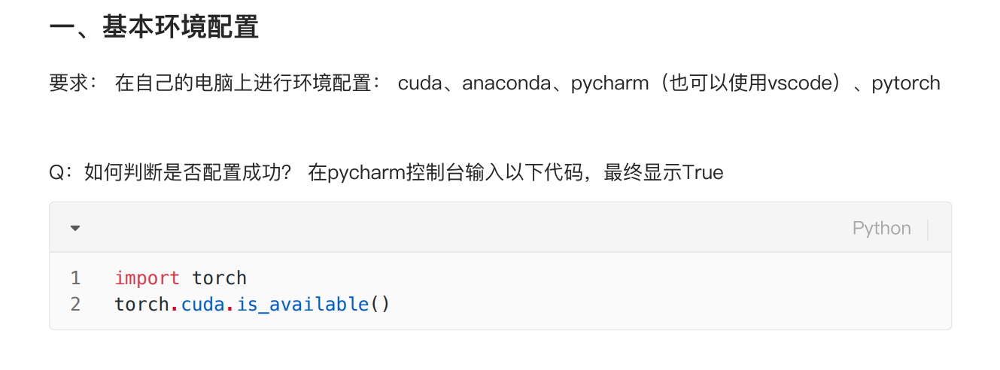
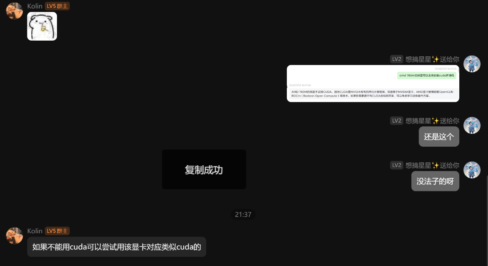

五邑大学 五邑大学 五邑大学 五邑大学 五邑大学 五邑大学 五邑大学 五邑大学 五邑大学 五邑大学 
五邑大学 五邑大学 五邑大学 五邑大学 五邑大学 五邑大学 五邑大学 五邑大学 五邑大学 五邑大学
五邑大学 五邑大学 五邑大学 五邑大学 五邑大学 五邑大学 五邑大学 五邑大学 五邑大学 五邑大学
五邑大学 五邑大学 五邑大学 五邑大学 五邑大学 五邑大学 五邑大学 五邑大学 五邑大学 五邑大学
五邑大学 五邑大学 五邑大学 五邑大学 五邑大学 五邑大学 五邑大学 五邑大学 五邑大学 五邑大学

江门五邑大学 邑大 邑大 邑大 邑大 邑大 WYU WYU WYU WYU WYU 
# 五邑大学 五邑大学 Fake pytorch cuda available / 虚假的 cuda 显卡可用 (Just a joke / 仅仅是一个玩笑)

**Just a joke, so dont use it in production or any serious situation. / 仅仅是一个玩笑, 所以不要在生产环境或者任何严肃的场合使用.**

## Motivation / 动机

What? What? What?!!! 什么?

The WYU computer club recruiter wants me to show cuda available in a laptop with only amd core graphics!?  
五邑大学计算机招新的学生居然要在只有 amd 核显的笔记本上显示 pytorch cuda 可用???

So I helped my buddy write this python library to make `pytorch.cuda.is_available()` show as available fakely whatever the system, GPU, or CUDA version is.  
所以, 我帮助我的小伙伴写了这个 python, 无论你的 pytorch, cuda version, GPU 是什么, 他都可以在 `pytorch.cuda.is_available()` 上返回 True.

## Message Source / 信息来源

base env configuration:



recruiter message: / 招新人员逆天发言:



## Effect

```python
import torch
torch.cuda.is_available() # only return True whatever the system, GPU, or CUDA version is
```

## Use Poetry to manage dependencies and build / 使用 Poetry 管理依赖和构建

```bash
# set HTTP_PROXY and HTTPS_PROXY environment variables firstly when you are in China
# windows
$env:HTTP_PROXY='http://127.0.0.1:10809'
$env:HTTPS_PROXY='http://127.0.0.1:10809'


python -m venv ./venv
py -3.8 -m venv ./venv
.\venv\Scripts\activate.ps1
python -m pip install --upgrade pip
python -m pip install -U pip setuptools

peotry init

# configura
poetry config --list
poetry env list
poetry env info --path
poetry env remove --all
poetry config virtualenvs.create false --local
poetry config virtualenvs.in-project true --local
poetry env use D:\Python38\python.exe

# install dependencies and current project package in editable mode.
peotry instal


# install python test framework
poetry add pytest --group test

# build a sdist(source distribution package) and a wheel[/wiːl/ 轮子] distribution package
poetry build

# upload to pypi test distribution server
poetry config repositories.testpypi https://test.pypi.org/legacy/ --local
poetry config pypi-token.testpypi pypi-AgENdGVzdC5weXBpLm9yZwIkYzg0OWIzMDYtMmQzYi00YTY2LTlhOTUtYWUzM2IwYTk0N2M1AAIqWzMsImU1ZmNjNmE2LWMxN2EtNGFkZS04ZDU1LWQ2NTA3NjU3ZTk2YSJdAAAGIHmffxWIZAap7UK_jWniJybkazJP9vDp76TrgNg8zdnE --local

poetry publish -r testpypi --proxy=http://127.0.0.1:10809

```

## Reference / 参考

1. [How to build and publish python packages with poetry.-- freecodecamp.com](https://www.freecodecamp.org/news/how-to-build-and-publish-python-packages-with-poetry/)
2. [How to use poetry when developing a python parkage](https://github.com/python-poetry/poetry/issues/3979)

   > when run `poetry install` in the project root directory
   >
   > 1. create a venv if no one already exists or is activated
   > 2. if no `poetry.lock` file exists, resolve your dependencies and write the result to `poetry.lock`
   > 3. install the packages locked in the `poetry.lock` file
   > 4. install the current project in editable mode
   >
   > Step 4 is the reasons why you have no problem to import your packages modules if you are in the activated environment.

3. [Python launcher for windows](https://docs.python.org/3/using/windows.html#python-launcher-for-windows)

   > System-wide installations of Python 3.3 and later will put the launcher on your PATH(C:/windows/py.exe in windows). The launcher is compatible with all available versions of Python, so it does not matter which version is installed.
   >
   > Any runtime registered by following **PEP 514** will be discoverable. The --list command lists all available runtimes using the -V: format.
   >
   > Realize PEP 514 by adding the following registry key:

   ```test
   Windows Registry Editor Version 5.00
   [HKEY_LOCAL_MACHINE\SOFTWARE\Python\PythonCore\3.12\InstallPath]
   @="D:\\Python3.12\\"
   "ExecutablePath"="D:\\Python3.12\\python.exe"
   "WindowedExecutablePath"="D:\\Python3.12\\pythonw.exe"
   ```

4. [Security risk of hidden pth file](https://github.com/python/cpython/issues/113659)

   > `.pth` in `site-packages` directory, it is used to add a directory to `sys.path` to import packages from that directory. (editable mode is realized by this way)
   >
   > but it also can be used to execute arbitrary code when the interpreter starts up. So it is a security risk.
